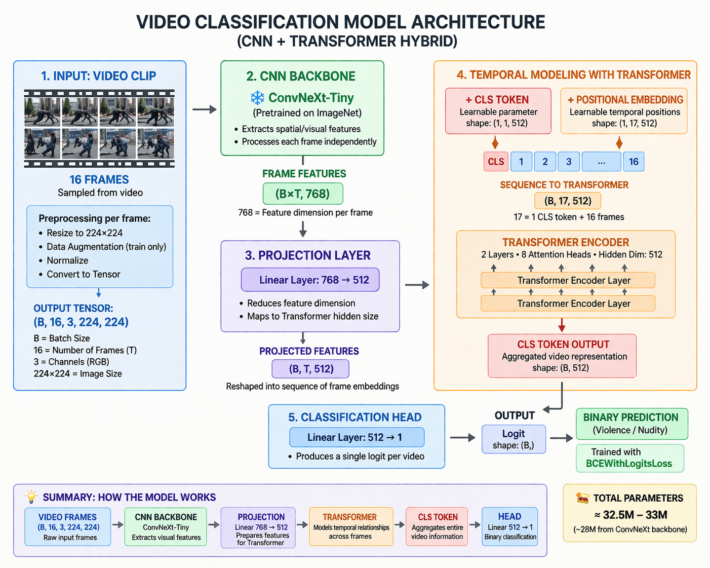

# 🎬 Video Content Moderation — Violence & Nudity Detection

A deep learning system for automatic video content moderation that detects **violence** and **nudity** in video clips using a CNN + Transformer hybrid architecture. Two separate binary classifiers are trained independently and combined at inference time.

---

## 📐 Model Architecture



The model is a **CNN + Transformer hybrid** designed for temporal video understanding. It processes videos as sequences of frames and uses both spatial (per-frame) and temporal (cross-frame) reasoning to make a binary prediction.

### Architecture Overview

**1. Input**
Videos are uniformly sampled to a fixed clip of **16 frames**. Each frame is resized to `224×224` and normalized. The resulting input tensor shape is `(B, 16, 3, 224, 224)`.

**2. CNN Backbone — ConvNeXt-Tiny**
Each frame is processed independently through a **ConvNeXt-Tiny** backbone pretrained on ImageNet. The backbone extracts rich spatial/visual features per frame, producing an output of shape `(B×T, 768)` — where 768 is the feature dimension.

**3. Projection Layer**
A linear layer maps frame features from `768 → 512` dimensions to match the Transformer's hidden size. Output shape: `(B, T, 512)`.

**4. Temporal Modeling with Transformer**
A learnable **CLS token** `(1, 1, 512)` is prepended to the frame sequence. **Positional embeddings** `(1, 17, 512)` are added to encode temporal position. The combined sequence `(B, 17, 512)` is passed through a **2-layer Transformer Encoder** with 8 attention heads and hidden dim 512. The CLS token output aggregates information across all frames into a single video-level representation `(B, 512)`.

**5. Classification Head**
A final linear layer `512 → 1` produces a single logit per video. Binary predictions are made using **BCEWithLogitsLoss** during training, and `sigmoid` at inference.

> **Total Parameters: ~32.5M–33M** (~28M from ConvNeXt backbone)

Two identical model instances are trained separately — one for **violence** detection and one for **nudity** detection.

---

## 📦 Dataset Details

| Task | Dataset | Size | Classes |
|---|---|---|---|
| Violence | RWF-2000 + SCVD | 2,000 + SCVD clips | Violent / Non-Violent |
| Nudity | Curated (internet) | 1,300 clips | Nudity / Safe |

**Violence — RWF-2000 Dataset**
2,000 clips sourced from real-world street fights and crowd violence scenarios. Classes are balanced between Violent and Non-Violent, enabling robust violence detection across diverse real-world conditions.

**Violence — SCVD Dataset (Smart-City CCTV Violence Detection)**
A novel benchmark dataset specifically designed for CCTV-based violence detection in smart city environments. Unlike existing datasets such as NTU CCTV-Fights and Real-Life Violence Situations (RLVS) — which contain phone-recorded videos that alter distribution and focus — SCVD is composed entirely of CCTV footage, making it more suitable for real-world surveillance applications. It also introduces a **weapons detection class**, the first of its kind in video form, covering any handheld object that could be used to harm humans or property (beyond just guns/knives).

Both violence datasets are combined to train a single violence detection model.

**Nudity — Curated Dataset**
1,300 clips collected from the internet with variability in scenes and conditions for robust nudity detection.

**Preprocessing applied to all videos:**
- Fixed clip length: **16 frames** uniformly sampled
- Frame resolution: **224 × 224**
- Normalization: ImageNet mean/std `([0.485, 0.456, 0.406], [0.229, 0.224, 0.225])`
- Training augmentations: Random horizontal flip, ColorJitter


---

## 🗂️ Dataset Structure (for Training)

The training code expects a **separate CSV metadata file** for each task along with a dataset root folder. The directory layout should be:

```
dataset_binary/
├── violence_metadata.csv
├── nudity_metadata.csv
└── <video files referenced in CSVs>
```

Each CSV must contain the following columns:

| Column | Description |
|---|---|
| `filepath` | Relative path to video file from `dataset_root` |
| `violence` / `nudity` | Binary label: `1` = positive, `0` = negative |
| `split` | Either `"train"` or `"val"` |

**Example `violence_metadata.csv`:**
```
filepath,violence,split
violence/fight_001.mp4,1,train
violence/fight_002.mp4,1,val
neutral/safe_001.mp4,0,train
neutral/safe_002.mp4,0,val
```

The absolute path for each video is resolved as:
```
abs_filepath = dataset_root / filepath
```

---

## 🏋️ Training Procedure

Two models are trained **independently** in sequence — first violence, then nudity — using the same model architecture and training loop.

### Configuration

All hyperparameters are set in the `Config` dataclass at the top of `train_separate_models.py`:

| Parameter | Default | Description |
|---|---|---|
| `dataset_root` | `dataset_binary` | Root folder of the dataset |
| `violence_csv` | `dataset_binary/violence_metadata.csv` | Violence metadata CSV |
| `nudity_csv` | `dataset_binary/nudity_metadata.csv` | Nudity metadata CSV |
| `output_dir` | `runs/separate_models` | Where best model weights are saved |
| `pretrained_weights` | `pretrained/convnext_tiny.fb_in1k.pth` | Path to pretrained ConvNeXt-Tiny weights |
| `image_size` | `224` | Frame resize resolution |
| `num_frames` | `16` | Frames sampled per video |
| `batch_size` | `16` | Training batch size |
| `backbone_name` | `convnext_tiny.fb_in1k` | timm model name |
| `embed_dim` | `768` | ConvNeXt output dimension |
| `proj_dim` | `512` | Transformer hidden dimension |
| `lr` | `1e-4` | AdamW learning rate |
| `epochs` | `20` | Number of training epochs |

### Setup

```bash
pip install torch torchvision timm opencv-python pandas tqdm pillow
```

Place the pretrained ConvNeXt-Tiny weights at `pretrained/convnext_tiny.fb_in1k.pth`. These can be downloaded from the [timm model hub](https://huggingface.co/timm).

### Run Training

```bash
python train_separate_models.py
```

This trains the violence model first, then the nudity model. Best checkpoints (lowest validation loss) are saved to:
```
runs/separate_models/
├── violence_best.pth
└── nudity_best.pth
```

### Training Loop Details

- **Optimizer:** AdamW
- **Loss:** `BCEWithLogitsLoss` (binary cross-entropy with logits)
- **Frame sampling (train):** Random contiguous window of `num_frames` frames
- **Frame sampling (val/test):** Uniformly spaced frames across full video
- **Augmentations (train only):** Random horizontal flip + ColorJitter
- **Checkpointing:** Best model by validation loss saved per task

---

## 🔍 Inference Procedure

Two inference scripts are provided:

| Script | Purpose |
|---|---|
| `infer_separate_model.py` | Single video inference — prints probabilities and labels |
| `full_inference_separated_model.py` | Full dataset evaluation — computes classification metrics |

---

### Single Video Inference (`infer_separate_model.py`)

**Dataset / Input structure required:**
Just a path to any `.mp4` video file. No folder structure needed.

**Usage:**
Edit the `video_path` variable at the bottom of the script, then run:

```bash
python infer_separate_model.py
```

**Config paths to set:**
```python
violence_model_path: str = "separate_models/violence_best.pth"
nudity_model_path:   str = "separate_models/nudity_best.pth"
pretrained_weights:  str = "pretrained/convnext_tiny.fb_in1k.pth"
```

**Output example:**
```
===== RESULTS =====
Video: /path/to/video.mp4
Violence: VIOLENCE (0.872)
Nudity:   SAFE (0.031)
```

Default thresholds: `0.5` for both violence and nudity.

---

### Full Dataset Evaluation (`full_inference_separated_model.py`)

This script evaluates both models across an entire labeled dataset and reports per-class and combined metrics using `sklearn.classification_report`.

**Expected Dataset Structure:**
Videos must be organized into **class-named subdirectories** under a root folder:

```
dataset/
├── violence/
│   ├── fight_001.mp4
│   ├── fight_002.mp4
│   └── ...
├── nudity/
│   ├── clip_001.mp4
│   └── ...
└── neutral/
    ├── safe_001.mp4
    └── ...
```

The `CLASSES` list at the top of the script defines which subdirectories are scanned:
```python
CLASSES = ["nudity", "violence", "neutral"]
```

Ground truth labels are derived from the folder name:
- `neutral` → binary label `0` (SAFE)
- `violence` or `nudity` → binary label `1` (UNSAFE)

**Config to set:**
```python
DATASET_ROOT = "/path/to/your/dataset"
violence_model_path = "separate_models/violence_best.pth"
nudity_model_path   = "separate_models/nudity_best.pth"
pretrained_weights  = "pretrained/convnext_tiny.fb_in1k.pth"
```

**Run evaluation:**
```bash
python full_inference_separated_model.py
```

**Output includes:**
- Per-video predictions with probabilities
- Combined SAFE/UNSAFE classification report
- Separate violence model classification report
- Separate nudity model classification report

**Decision logic used in evaluation:**

The final prediction is the **OR** of the two model outputs:
```python
v_pred = 1 if v_prob > 0.1 else 0       # violence threshold
n_pred = 1 if n_prob > 0.9999 else 0    # nudity threshold (very strict)
final_pred = 1 if (v_pred or n_pred) else 0
```

> ⚠️ These thresholds are tuned for specific dataset characteristics. Adjust them based on your own precision/recall requirements.

---

## 📁 Expected Directory Layout (Full Project)

```
project/
├── pretrained/
│   └── convnext_tiny.fb_in1k.pth       # Pretrained backbone weights
├── dataset_binary/                      # For training
│   ├── violence_metadata.csv
│   ├── nudity_metadata.csv
│   └── <video files>
├── dataset/                             # For full evaluation
│   ├── violence/
│   ├── nudity/
│   └── neutral/
├── separate_models/                     # Trained model weights (output)
│   ├── violence_best.pth
│   └── nudity_best.pth
├── train_separate_models.py
├── infer_separate_model.py
└── full_inference_separated_model.py
```
